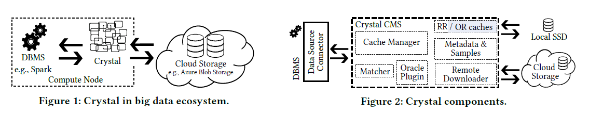
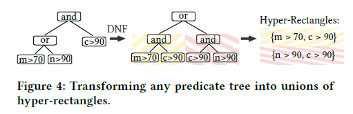
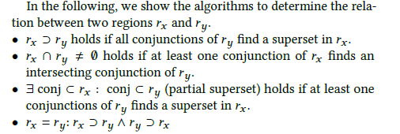
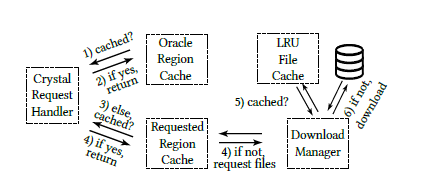

# Crystal: A Unified Cache Storage System for Analytical Databases

## 背景

在云上存储计算分离的模式下，探索在计算节点上做cache的方法。

云环境特点：

- high latency and low bandwidth

挑战：

- 每个DBMS都有自己的caching layer
- 因为支持基于raw data format的analytical query，处理raw data的速度很重要
- 现在的基于page的cache利用率很低
- 怎样更好地利用本地cache来支持查询下压

## Crystal设计

分成一个DBMS connector和一个cache management system，CMS会管理local或remote的cached data。

好处：

- 可以share across different DBMS
- cache管理对于DBMS无感知
- cache层可以独立优化cache结构，比如存多种view

分为requested region(RR)和oracle region(OR)，RR用作buffering，而OR会基于统计来做优化

### Region Splitting

如何判断两个region的关系

Crystal对于Region的做法：

- 先把query需要的predicate转成disjunction of conjunctions
- 遇到一个新的请求：
  - 先看cache里是否存在这个predicate的超集
  - 没有的话，再按每个conjunction来看

缓存不能有overlap

### Cache Optimization

TODO