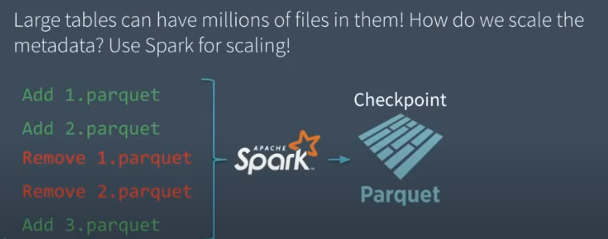

# Delta Lake

通过transaction log为对象存储提供ACID能力

为什么云端对象存储越来越流行？

- 存储计算分离，不需要为计算能力买单

现在云端对象存储面临的问题有哪些？

- multi-object updates cannot be atomic, no isolation between queries.  like one query trying to update multiple objects in the table, readers will see partial updates as the query updates each object individually.
- Rolling back writes is also difficult, if an update query crashes, the table is in a corrupted state.
- 当对象特别多时，比如millions，元数据管理很expensive，比如reading a stats footer can take a few milliseconds, but the latency of cloud object stores is so much higher that these data skipping checks can take longer than the actual query.

Databricks早期一半的support escalation都是关于数据损坏，一致性和性能问题的。

Delta Lake的benefits

- 事务支持
- Time Travel: Snapshots or roll back
- Efficient streaming I/O: 可以直接写小对象然后读，后边Delta Lake再重整
- Caching，因为对象和log都不可修改，所以local caching更容易了
- Schema Evolution：无需重写就读老的parquet file

## Challenges

- Metadata APIs are generally expensive
- 一致性问题，比如create 后 list不一定能看到，即使这个client就是create的那个。以S3为例，保证read-after-write，但如果先get了一个不存在的key，然后put，接下来再get会有一段时间get 不到，因为S3的negative caching。然后S3的list是最终一致的，所以put后list不一定能看到put的那个key
- 性能问题，主要三点
  - Keep frequently accessed data close-by sequentially，像列存那样
  - Make objects large, but not too large。太大了update代价很大，因为要重写
  - 避免LIST。因为LIST延迟大而且数量受限，通常要并行执行好多个LIST
- Table Storage问题
  - Directory of files.按directory组织，会有一致性和性能上的问题。比如原子性，最终一致，性能不好（需要list去找query需要的object），没有管理能力（没有多版本，audit log）
  - Custom Storage Engines like Snowflake. 把cloud object当做dumb block device，然后像数据库一样去实现元数据管理。问题有：需要有一个高可用的元数据管理节点（expensive而且会lock in one vendor）；I/O需要先去元数据服务，增加了开销，降低了性能；不利于保持data format一致，比如都是parquet。Hive有点类似，通过一个RDBMS作为metadata store，但这样这个metastore节点会成为瓶颈
  - Metadata in Object Stores. Delta Lake直接用对象存储来存transaction log

## The Delta Log

Transaction log

### Atomicity

Changes to the table are stored as ordered, atomic units called commits.

### Serializability

Need to agree on the order of changes, even when there are multiple writers

Why 乐观？ 因为Data lake 通常读多写少

怎么做的？

1. Record start version

2. Record reads/writes

3. Attempt commit

4. If someone else wins, check if anything you read has changed.

5. Try again

### Handling Massive Metadata

# Lakehouse

feature:

- base on open direct-access data formats
- have first-class support for machine learning and data science
- offer state-of-the-art performance

目前的data lake的问题：

- 两次ETL，先ETL到lake，然后再ETL到warehouse，creating complexity,delays and new failure modes
- 可靠性：保证data lake和data warehouse的数据consistent is difficult and costly. Each ETL step also risks incurring failures or introducing bugs.
- Data Staleness: 通常data warehouse中的data不是最新的
- 对advanced analytics支持有限：TensorFlow Pytorch等都对data warehouse的API支持有限，但支持open direct-access formats，因此在data warehouse上做这些事需要再导出来，或者直接在data lake上做，但这样就失去了data warehouse的管理能力，如ACID, data versioning and indexing.
- Total cost of ownership：贵，需要存好几份数据

Lakehouse解决的关键问题：

- 可靠的数据管理：store raw data while simultaneously support ETL, support transactions, rollbacks, zero-copy cloning
- 支持ML/DS：主要是对direct-access open formats 和 Spark API的兼容
- SQL性能：SQL on Parquet

Challenges：

- 解决两轮ETL的问题
- 解决data staleness的问题，第一代data warehouse基本都是即时处理，而现在因为量大需要周期性的ETL
- 对unstructured data的支持
- 对ML/DS的支持，可以直接用

## Architecture

### 实现

基于standard format实现一个元数据层来支持事务

#### Metadata Layer

比如Delta Lake/Apache Iceberg/Apache Hudi，都是基于direct-access open format来做metadata layer，提供ACID

此外，还做了data quality enforcement，即如果data和schema不匹配会报错

用metadata layer做access control和audit logging

现在的问题：latency，跨表事务，format，size

#### Sql Performance

如何在支持乱七八糟的格式的情况下保证SQL性能

- Caching：把object缓存在处理节点的SSD或者内存里，因为很容易判断缓存的对象是否还valid。cache可以转换成more efficient format for query engine
- Auxiliary data：比如在transaction log里也存column min/max，这样可以filter data。比如bloom filter
- Data layout：比如record ordering，Delta Lake 支持Z-order

性价比优势比较明显